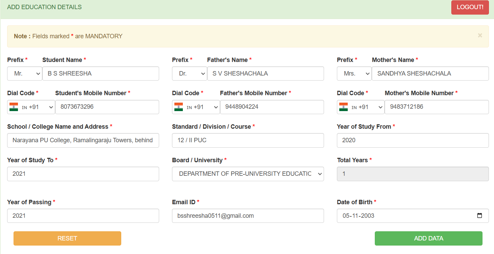
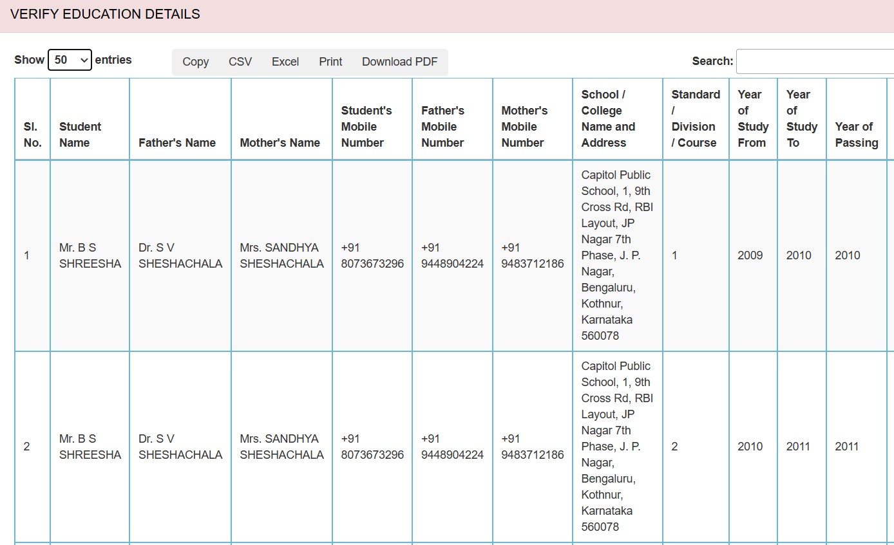
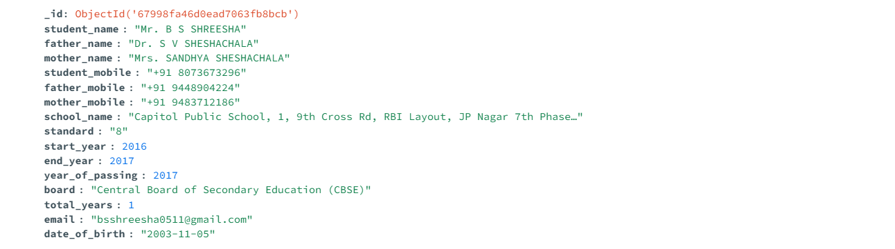
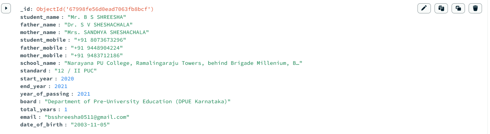

# Education Management System

This is a web-based **Education Management System** built using **Flask**, **MongoDB**, **DataTables**, **Bootstrap**, **jQuery**, and **JavaScript**. The application allows users to manage student education details, including personal information, school details, and academic records.

---

## Features

- **Add Student Details**: Users can input student details, including name, mobile number, email, date of birth, and academic records.
- **Form Validation**: Client-side validation ensures correct data entry.
- **Data Storage**: Uses **MongoDB** for storing student records.
- **DataTables Integration**: Displays student data with sorting, filtering, and export options (CSV, Excel, PDF, Print).
- **Real-Time Updates**: New entries appear dynamically in the table without reloading the page.
- **Responsive Design**: Built with **Bootstrap** for mobile and desktop compatibility.

---

## Technologies Used

- **Backend**: Flask (Python)
- **Database**: MongoDB
- **Frontend**: HTML, CSS (Bootstrap), JavaScript, jQuery, DataTables
- **Libraries**:
  - DataTables for interactive tables
  - Bootstrap for styling
  - jQuery for AJAX requests and event handling

---

## Installation

### 1. Clone the Repository
```bash
git clone https://github.com/your-username/education-management.git
cd education-management
```

### 2. Install Dependencies
Ensure you have Python 3 installed. Then, install the required packages:
```bash
pip install flask pymongo
```

### 3. Start MongoDB
Make sure MongoDB is installed and running:

### 4.Run the Flask Application
```bash
python backend.py
```

The server will start at http://localhost:5000/.

## File Structure

```
education-management/
│── static/
│   ├── css/
│   │   ├── styles.css
│   ├── js/
│   │   ├── scripts.js
│── templates/
│   ├── index.html
│── backend.py
│── README.md

```

## 5. Images




